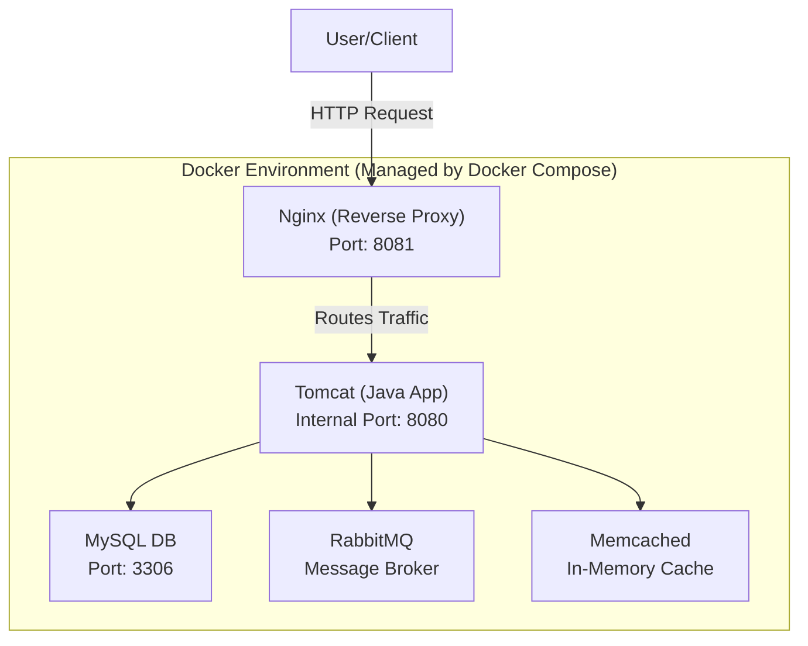

# 👋 Hi, I'm Paul — DevOps Engineer

Welcome to my project repository! I'm passionate about building robust, scalable, and production-ready solutions using modern DevOps and software engineering practices. This repository is a showcase of my ability to design, implement, and orchestrate multi-service web application stacks using Docker Compose and Java.

---

## 🚀 About Me

Open for DevOps roles.

- 🛠️ **Core Skills:**
  - **Containerization & Orchestration:** Docker, Docker Compose
  - **CI/CD & Automation:** GitHub Actions, Shell Scripting
  - **Cloud & Infrastructure:** Linux, Nginx, Tomcat
  - **Backend:** Java, Spring
  - **Databases & Messaging:** MySQL, RabbitMQ, Memcached
  - **Monitoring & Optimization:** Logback, Performance Tuning
- 🌍 **Interests:** Cloud Infrastructure, Automation, Microservices, Scalable Systems, Continuous Delivery
- 📫 **Contact:** [LinkedIn](https://www.linkedin.com/in/senopaul/)

---

## 🏆 What I Do

- Architect and deploy multi-service applications using containerization (Docker, Docker Compose)
- Develop backend services in Java (Spring ecosystem)
- Integrate caching, messaging, and database solutions for high performance
- Automate workflows and CI/CD pipelines
- Optimize for scalability, reliability, and maintainability
- Continuously learn and adapt to new DevOps tools and practices

---

## 📂 Project Showcase: Multi-Service Web Application Stack

This project provides a production-ready, multi-service web application stack orchestrated using Docker Compose. It integrates essential components for modern web applications.

### 🏛️ Architecture Diagram



### ✨ Key Features
- **Modular Architecture**: Each service runs in its own container for easy management and scaling.
- **Data Persistence**: Volumes ensure important data is retained across container restarts.
- **Network Isolation**: All services communicate over a dedicated Docker network.
- **Ready for Development & Production**: Easily extend or customize for your needs.

### 💻 Technologies & Tools

      

### Getting Started

#### Prerequisites

- [Docker](https://www.docker.com/products/docker-desktop)
- [Docker Compose](https://docs.docker.com/compose/)

#### Quick Start

1. **Clone the repository:**
   ```sh
   git clone https://github.com/senopaul/Docker-Compose-Multiservice-App.git
   cd Docker-Compose-Multiservice-App
   ```

2. **Start all services:**
   ```sh
   docker-compose up -d
   ```

3. **Access the services:**
   - **MySQL**: Connect with a client at `localhost:3306` (user: `myuser`, password: `mypassword`)
   - **RabbitMQ Management UI**: [http://localhost:15672](http://localhost:15672) (user: `myuser`, password: `mypassword`)
   - **Tomcat**: [http://localhost:8080](http://localhost:8080)
   - **Nginx**: [http://localhost:8081](http://localhost:8081)

### Customization

- **Add your Java webapps** to `app/webapps/` for Tomcat deployment.
- **Place static HTML files** in `web/html/` for Nginx.
- **Modify environment variables** in `docker-compose.yml` as needed.

---

## 📈 GitHub Stats


---

## 🤝 Let's Connect!

Open for DevOps roles. Connect with me on [LinkedIn](https://www.linkedin.com/in/senopaul/).

---

> _Thank you for visiting!_

---


