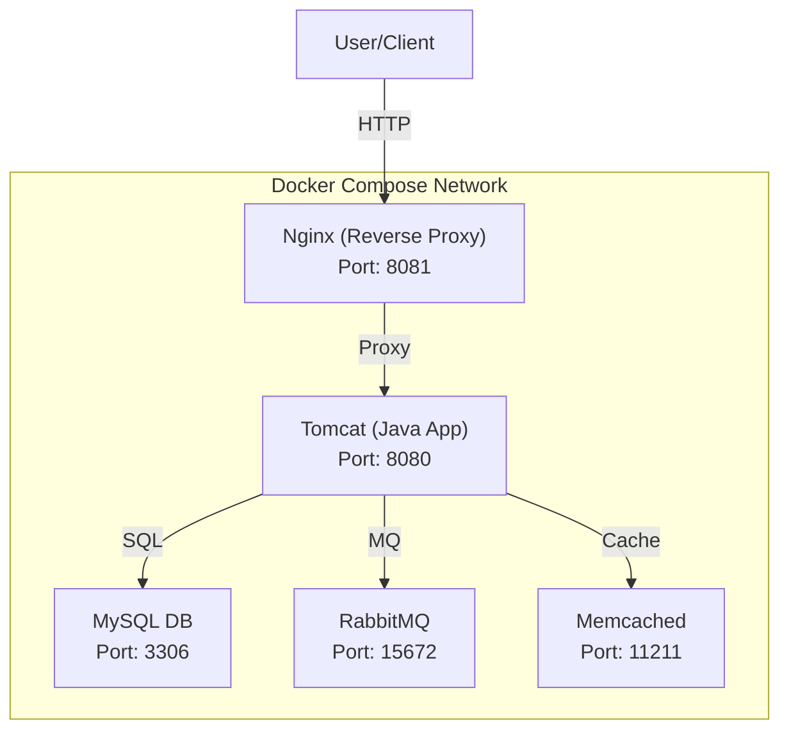

# 🚀 Docker-Compose-Multiservice-App

A production-ready, modular web application stack for modern DevOps and Java development.


---

## 📋 Table of Contents
- [Overview](#overview)
- [Features](#features)
- [Architecture](#architecture)
- [Project Structure](#project-structure)
- [Local Setup](#local-setup)
- [Usage](#usage)
- [Customization](#customization)
- [Contributing](#contributing)
- [Contact](#contact)
- [License](#license)

---

## 📝 Overview

**Docker-Compose-Multiservice-App** is a robust, scalable, and modular web application stack designed for rapid development and deployment. It leverages Docker Compose to orchestrate multiple essential services for enterprise-grade Java web applications.

---

## ✨ Features
- **Modular Architecture:** Each service runs in its own container for easy management and scaling.
- **Data Persistence:** Volumes ensure important data is retained across container restarts.
- **Network Isolation:** All services communicate over a dedicated Docker network.
- **Production-Ready:** Easily extend or customize for your needs.
- **DevOps Focus:** Built for CI/CD, automation, and modern infrastructure practices.

---

## 🏗 Architecture



---

## 📁 Project Structure

```
.
├── app/                # Java web application files for Tomcat
├── db_data/            # MySQL data (persisted)
├── web/                # Static web content for Nginx
├── docker-compose.yml  # Main Docker Compose configuration
├── nginx.conf          # Nginx configuration
├── pom.xml             # Java project config
└── ...
```

---

## 🛠 Local Setup

### Prerequisites
- [Docker](https://www.docker.com/products/docker-desktop)
- [Docker Compose](https://docs.docker.com/compose/)

### Quick Start
1. **Clone the repository:**
   ```sh
   git clone https://github.com/senopaul/Docker-Compose-Multiservice-App.git
   cd Docker-Compose-Multiservice-App
   ```
2. **Start all services:**
   ```sh
   docker-compose up -d
   ```
3. **Access the services:**
   - MySQL: `localhost:3306` (user: `myuser`, password: `mypassword`)
   - RabbitMQ UI: [http://localhost:15672](http://localhost:15672) (user: `myuser`, password: `mypassword`)
   - Tomcat: [http://localhost:8080](http://localhost:8080)
   - Nginx: [http://localhost:8081](http://localhost:8081)

---

## 🚦 Usage
- **Add Java webapps** to `app/webapps/` for Tomcat deployment.
- **Place static HTML files** in `web/html/` for Nginx.
- **Modify environment variables** in `docker-compose.yml` as needed.

---

## 🛠 Customization
- Extend the stack with additional services as needed.
- Integrate with CI/CD pipelines for automated testing and deployment.
- Tune resource limits and environment variables for your use case.

---

## 🤝 Contributing

Contributions are welcome! Please fork the repository, create a feature branch, and submit a pull request. For major changes, open an issue first to discuss what you would like to change.

---

## 📞 Contact

- **Creator:** Paul (Open for DevOps roles)
- **GitHub:** [senopaul](https://github.com/senopaul)
- **LinkedIn:** [senopaul](https://www.linkedin.com/in/senopaul/)

---

## 📄 License

This project is licensed under the MIT License.

---


